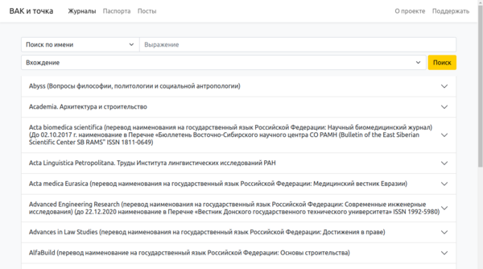

## VAK-i-tochka

### Stack:
* Python
  * aiohttp
  * Gino
  * asyncio
* JavaScript
  * Vue.js
* Docker

### Responsibilities:
All tasks from design to deploy.

### Description:
It was a project to search for information about scientific journals.
I wrote a parser for PDF documents to get information about all journals,
saved it in the database and wrote a search.

